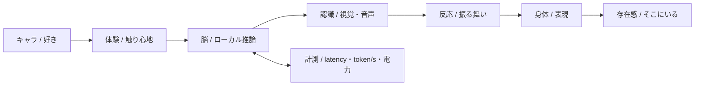

<div align="center">

```
 ██╗██╗  ██╗██╗ ██████╗  █████╗ ███╗   ███╗██╗   ██████╗ ███████╗██╗   ██╗
 ██║██║ ██╔╝██║██╔════╝ ██╔══██╗████╗ ████║██║   ██╔══██╗██╔════╝██║   ██║
 ██║█████╔╝ ██║██║  ███╗███████║██╔████╔██║██║   ██║  ██║█████╗  ██║   ██║
 ██║██╔═██╗ ██║██║   ██║██╔══██║██║╚██╔╝██║██║   ██║  ██║██╔══╝  ╚██╗ ██╔╝
 ██║██║  ██╗██║╚██████╔╝██║  ██║██║ ╚═╝ ██║██║██╗██████╔╝███████╗ ╚████╔╝
 ╚═╝╚═╝  ╚═╝╚═╝ ╚═════╝ ╚═╝  ╚═╝╚═╝     ╚═╝╚═╝╚═╝╚═════╝ ╚══════╝  ╚═══╝
```

# 🐮 ForgottenCow

<sub>ゲームとか、キャラクターとか、ロボットとか。作ってます。</sub>

<br>


&nbsp;


</div>

---

```bash
cow@sfc:~$ cat /etc/motd
```

> **忘れられた牛は、忘れられない"好き"を作りたい。**
> ただそれだけ。

ゲームとロボットの間にある「キャラクターが"そこにいる"感じ」を作りたくて、
絵・3D・UI・推論・実機まで、つながるところをつないでます。

[**Sociable Robots Lab**](https://sr.sfc.keio.ac.jp/www/en/) — 慶應SFC / ヒトと駆け引きをするモノたちの未来

---

```bash
cow@sfc:~$ cat /proc/loadout
```

<div align="center">


<br>


<br>


</div>

```
 ┌──────────────────────────────────────────────────────┐
 │  CODE    ███████████████████░░░░  Python / C#        │
 │  ENGINE  ██████████████████░░░░░  Unity              │
 │  3D      █████████████████░░░░░░  Blender / Fusion   │
 │  ART     ████████████████████░░░  Clip Studio Paint  │
 │  VIDEO   ███████████████░░░░░░░░  Adobe (AE/PR/PS)  │
 │  GRIT    ████████████████████████  測定不能          │
 └──────────────────────────────────────────────────────┘
```

---

```bash
cow@sfc:~$ ps aux --sort=-priority
```

### 🎮 CotoVerse &nbsp; <a href="https://apps.apple.com/jp/app/cotoverse/id6740241627"></a>

3Dアニメキャラと会話できるアプリ。[**BlendAI**](https://apps.apple.com/jp/app/cotoverse/id6740241627) チームで開発。
UI/UXと機能企画を中心に触って、Unity Sentisでローカル推論も載せた。
端末の中にAIの脳を入れた。サーバーいらず。

### 🔥 IKIGAMI &nbsp; 

"雰囲気"だけじゃなく、世界観をちゃんとルールにするRPGを作ってます。

<details>
<summary>&nbsp;いまの状況</summary>

```
[STATUS]  ██████████░░░░░░░░░░  鍛造中
[TODO]    ちゃんと形にする
```

</details>

### 🤖 ロボット &nbsp; 

ローカル推論 + センサー + 反応設計あたりを触ってる。
「賢い」より先に「ちゃんとそこにいる」が目標。

---

```bash
cow@sfc:~$ lspci | grep GPU
```

<div align="center">
  
</div>

```yaml
Device:   NVIDIA DGX Spark ×2
Arch:     Grace Blackwell
Memory:   128GB Unified / unit
Purpose:  ロボットに脳を与える
Sticker: （そう、私はでびるコネクションファンです）
```

---

```bash
cow@sfc:~$ cat /var/log/blueprint.md
```

やりたいことの流れ。全部つながってる（つもり）。



---

```bash
cow@sfc:~$ git log --oneline --graph
```

```
* ◇ 2030  かわいいロボットを社会に届ける
│
* ◇ 2027  小さくてもいいから、続く形にする
│
* ◇ 2026  プロトタイプを"人に見せられる形"にする
│
* ◇ 2025  IKIGAMIを形にする / ロボットの腕 / 描く  ← HEAD
│
* ◆ 2024  CotoVerse リリース / Sociable Robots Lab 加入
```

---

```bash
cow@sfc:~$ fortune
```

<div align="center">
<table>
  <tr>
    <td align="center">
      <sub><code>$ cat /dev/random_creature</code></sub><br>
      <br>
      <sub><code>[WARN] Expected cow. Got cat. Acceptable.</code></sub>
    </td>
  </tr>
</table>
</div>

---

<div align="center">

```bash
cow@sfc:~$ echo $PHILOSOPHY
```

**「便利」を届けて、気づいたら、なくてはならない存在になっている。**

<br>

[](https://sr.sfc.keio.ac.jp/www/en/)
&nbsp;&nbsp;
[](mailto:cow@keio.jp)

```bash
cow@sfc:~$ exit
logout
Connection to forgottencow closed. 🐮
```

<br>

<sub>© モーモーホールディングス(株) / All moos reserved.</sub>

</div>
