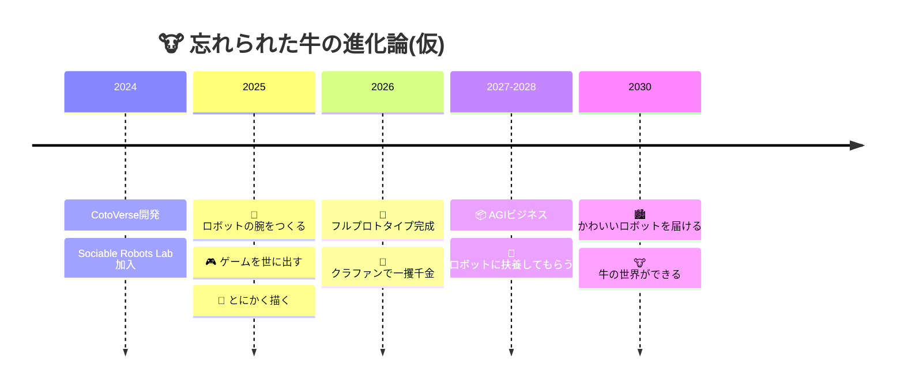

<div align="center">

# 🐮 ForgottenCow組み立て手順書

*私の名前かっこいいですよね、Googleに５歳の時につけてもらった名前です。*

<br>

[](https://sr.sfc.keio.ac.jp/www/en/)
[](mailto:cow@keio.jp)

</div>

---

## 📖 第0章 — はじまり

> インターネットの広大な草原に、たった一頭の牛がいた。

慶應SFCの[**Sociable Robots Lab**](https://sr.sfc.keio.ac.jp/www/en/)に棲んでます。
ヒトと駆け引きするロボットたちに囲まれて暮らす日々。

やりたいこと：**ロボティクス時代のキャラクター開発を、ハードからソフトまで全部やる。**
拡散モデルからサーボモーターまで、ピクセルアートから基板設計まで。

---

## ⚔️ 第1章 — 武器庫

```
 ┌──────────────────────────────────────────────┐
 │  CODE    ██████████████████░░░░  Python, C#  │
 │  3D      █████████████████░░░░░  Fusion360   │
 │          █████████████████░░░░░  Blender     │
 │          █████████████████░░░░░  Unity       │
 │  ART     ████████████████████░░  ClipStudio  │
 │          ███████████████░░░░░░░  Adobe全般   │
 │  根性    ██████████████████████  測定不能    │
 └──────────────────────────────────────────────┘
```

---

## 🗺️ 第2章 — 冒険の記録

### 🎮 CotoVerse
<a href="https://apps.apple.com/jp/app/cotoverse/id6740241627">
  
</a>

3Dアニメキャラと喋れるアプリ。**BlendAI**様のチームで開発。

- 🎨 UI/UXデザインと新機能開発をリード
- 🧠 Unity Sentisでローカル推論を実装
- 🛠️ Unity開発チームメンバー

### 🔥 IKIGAMI *（開発中）*
ちょっと待ってね。別に忘牛だからって忘れてないよ。

---

## 🧪 第3章 — 研究室の風景

> 🐮 *「うちの子たちです、ファンアート募集中」*

<div align="center">
  
  <br>
  <sub>DGX Spark × 2台。Grace Blackwell。128GB統合メモリ。そう、"でびるコネクショん"ファンです。</sub>
</div>


---

## 🔮 第4章 — この先の地図



---

## 🎲 第5章 — 日常

<table align="center">
  <tr>
    <td align="center"><b>🐱今日の仔猫🐾</b></td>
  </tr>
  <tr>
    <td align="center">
      
      <br>
      <sub>私の自認は猫です。</sub>
    </td>
  </tr>
</table>

---

<div align="center">

*Copyrighted By モーモーホールディングス(株)*


🐮

</div>
